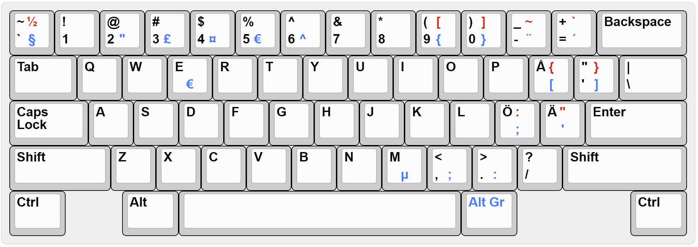

# The se-ansi keyboard layout

The se-ansi keyboard layout allows one to easily type Swedish on an ANSI keyboard with the US layout.
<kbd>Å</kbd> <kbd>Ä</kbd> <kbd>Ö</kbd> are located where one would expect them.
The placement of the other keys is identical to the US layout, with the exception of <kbd>[ {</kbd> <kbd>] }</kbd> <kbd>; :</kbd> <kbd>' "</kbd>.
They are accessed through <kbd>Alt Gr</kbd> (i.e. right <kbd>Alt</kbd>) and <kbd>Shift</kbd>+<kbd>Alt Gr</kbd>.
These symbols can also be reached on other keys, for more convenient use.

All symbols from the Swedish layout are retained, including the dead keys; however, their placement has been adapted to work with the US layout.



# Download
Download the latest release:

[](https://github.com/fichter/se-ansi/releases/latest)

# Windows (Native Driver)
**Requirement:** Administrative privileges.

**Prerequisites:** Download and install [Microsoft Keyboard Layout Creator 1.4 (MSKLC)](https://www.microsoft.com/en-us/download/details.aspx?id=102134).

1. Open [windows/se-ansi.klc](windows/se-ansi.klc) in MSKLC.
2. Build the installer via *Project* -> *Build DLL and Setup Package*.
3. Run the generated setup program to install it natively on any Windows system. The keyboard layout is installed as **Svensk ANSI**.

# Windows (AutoHotkey)
**Requirement:** No administrative privileges needed.

**Prerequisites:** Download and install [AutoHotkey v2](https://www.autohotkey.com/).

## Usage
1. Set your base Windows keyboard layout to standard **US (English)**.
2. Double-click the [windows/se-ansi.ahk](windows/se-ansi.ahk) file to run it. 

## Run Automatically on Startup
1. Open `shell:startup` in Windows Explorer.
2. Create a shortcut in this folder pointing to the following destination (adjust the paths as needed):
`%localappdata%\Programs\AutoHotkey\v2\AutoHotkey64.exe %userprofile%\se-ansi.ahk`
3. The AutoHotkey icon should be visible in the system tray.

## Linux (XKB)

### User-specific (non-root)
*Does not work with Wayland*

Copy `linux/se-ansi` to a directory named `symbols`, for example `$HOME/.xkb/symbols`. Then create an autostart file `$HOME/.config/autostart/xkb-se-ansi.desktop` with the following content.
```
[Desktop Entry]
Encoding=UTF-8
Type=Application
Name=se-ansi keyboard layout
Exec=bash -c 'setxkbmap se-ansi -option "" -print | xkbcomp -I"$HOME/.xkb" - $DISPLAY'
```
### System-wide (root)
*Tested on Ubuntu 21.10*

Add the contents of `linux/se-ansi` to the end of the file `/usr/share/X11/xkb/symbols/se`. Then find the following section in `/usr/share/X11/xkb/rules/evdev.xml`:
```xml
<layout>
    <configItem>
    <name>se</name>
    <shortDescription>sv</shortDescription>
    <description>Swedish</description>
    <languageList>
        <iso639Id>swe</iso639Id>
    </languageList>
    </configItem>
    <variantList>
```
Add the following under `<variantList>`:
```xml
        <variant>
          <configItem>
            <name>se-ansi</name>
            <description>Swedish (ANSI)</description>
          </configItem>
        </variant>
```
Reload xkb data:
```sh
sudo dpkg-reconfigure xkb-data
```

# License

This project is licensed under the MIT License.
