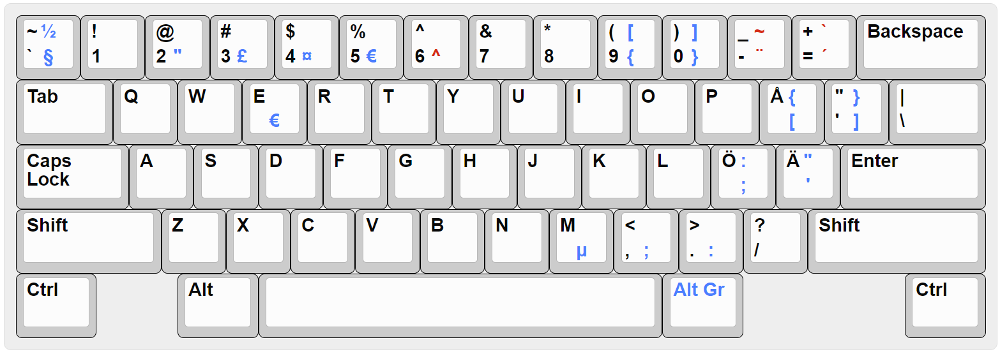

# The se-ansi keyboard layout

The se-ansi keyboard layout allows one to easily type Swedish on an ANSI keyboard with the US layout. <kbd>Å</kbd> <kbd>Ä</kbd> <kbd>Ö</kbd> are located where one would expect them. The placement of the other keys are identical to the US layout, with the exception of <kbd>[ {</kbd> <kbd>] }</kbd> <kbd>; :</kbd> <kbd>' "</kbd>. They are accessed through <kbd>Alt Gr</kbd> (i.e. right <kbd>Alt</kbd>) and <kbd>Shift</kbd>+<kbd>Alt Gr</kbd>. These symbols can also be reached on other keys, for more convenient use.

All symbols from the Swedish layout are retained, including the dead keys, however their placement have been adapted to work with the US layout.



# Building and installing
## Windows
Open `windows/se-ansi.klc` in [Microsoft Keyboard Layout Creator 1.4 (MSKLC)](https://www.microsoft.com/en-us/download/details.aspx?id=102134).

Select `Project`, `Build DLL and Setup Package`. This generates a setup program that can then be installed on any Windows system.

## Linux (XKB)
Tested on Ubuntu 21.10.

### User-specific (non-root)
Copy `linux/se-ansi` to a directory named `symbols`, for example `$HOME/.xkb/symbols/se-ansi`. Then create an autostart file `$HOME/.config/autostart/xkb-se-ansi.desktop` with the following content.
```
[Desktop Entry]
Encoding=UTF-8
Type=Application
Name=se-ansi keyboard layout
Exec=bash -c 'setxkbmap se-ansi -option "" -print | xkbcomp -I"$HOME/.xkb" - $DISPLAY'
```
### System-wide (root)
Add the contents of `linux/se-ansi` to the end of the file `/usr/share/X11/xkb/symbols/se`. Then find the following section in `/usr/share/X11/xkb/rules/evdev.xml`:
```xml
<layout>
    <configItem>
    <name>se</name>
    <shortDescription>sv</shortDescription>
    <description>Swedish</description>
    <languageList>
        <iso639Id>swe</iso639Id>
    </languageList>
    </configItem>
    <variantList>
```
Add the following under `<variantList>`:
```xml
        <variant>
          <configItem>
            <name>se-ansi</name>
            <description>Swedish (ANSI)</description>
          </configItem>
        </variant>
```
Reload xkb data:
```sh
sudo dpkg-reconfigure xkb-data
```

# License

Licensed under MIT.
